<p align="center">
  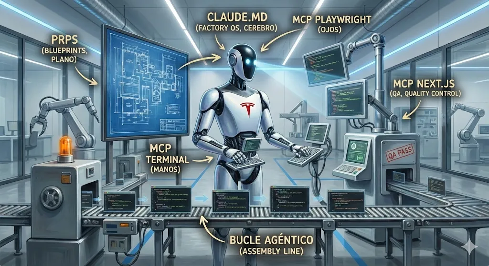
</p>

<h1 align="center">SaaS Factory</h1>

<p align="center">
  <strong>La maquina que construye la maquina es mas importante que el producto.</strong><br/>
  <em>— Elon Musk</em>
</p>

<p align="center">
  <a href="#recorrido-por-la-fabrica">La Fabrica</a> &bull;
  <a href="#el-golden-path-stack-unico">Tech Stack</a> &bull;
  <a href="#el-cyborg---3-mcps-trabajando-juntos">MCPs</a> &bull;
  <a href="#recursividad-agentica">Recursividad</a> &bull;
  <a href="#instalacion-2-minutos">Instalacion</a>
</p>

---

## Esto no es un repositorio. Esto es una fabrica de software.

La mayoria esta ahi afuera haciendo **"Vibe Coding"**, tirando prompts al azar o peor, atrapados en el infierno del No-Code construyendo telaranas que se rompen cuando las miras feo.

SaaS Factory es la **infraestructura exacta** para que el codigo deje de ser dados al azar y se convierta en un **activo empresarial**. Un sistema donde la IA no "adivina" — ejecuta con **precision industrial**.

<p align="center">
  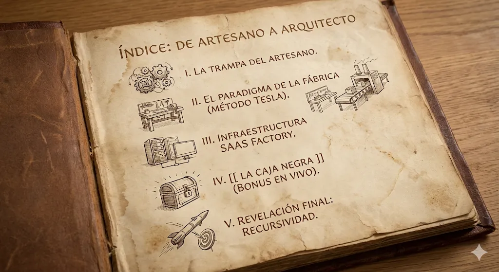
</p>

Cuando ejecutas `saas-factory`, copias toda la **infraestructura de la fabrica** al directorio actual. No es un template vacio. Es **production-ready desde el minuto 0**.

```
tu-proyecto/
├── CLAUDE.md              # Factory OS - Cerebro del agente
├── GEMINI.md              # Espejo para Gemini
├── .mcp.json              # MCPs configurados (Next.js, Playwright, Supabase)
├── src/                   # App con Feature-First Architecture
├── .claude/
│   ├── commands/          # /new-app, /landing, etc.
│   ├── PRPs/              # Blueprints de features
│   └── prompts/           # Assembly Line (bucle agentico)
└── package.json           # Next.js 16, React 19, Tailwind 3.4
```

---

## Recorrido por la Fabrica

Piensa en este sistema como una **fabrica automatizada de software**. Cada parte tiene su equivalente en una Tesla Gigafactory:

---

### 1. Factory OS (El Cerebro) — `CLAUDE.md`

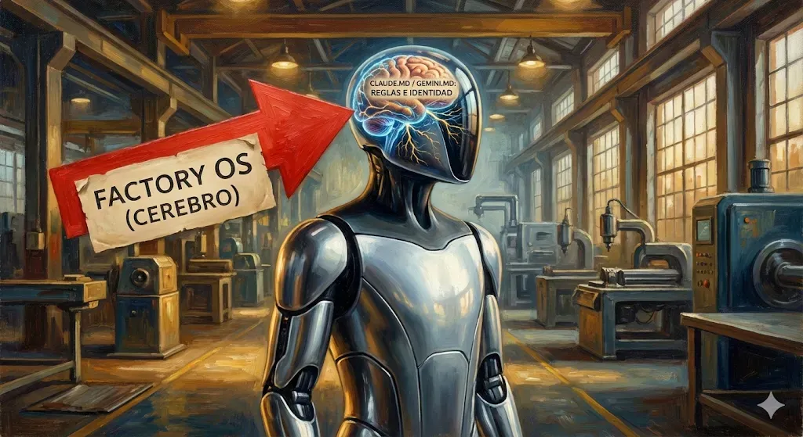

La **constitucion** de la fabrica. Aqui se define la identidad, el stack tecnologico y las reglas de oro. Sin esto, la IA esta perdida; con esto, sabe exactamente como debe entregar cada linea de codigo. Es el **sistema operativo de la inteligencia**.

---

### 2. Blueprints (Los Planos) — `.claude/PRPs/*.md`

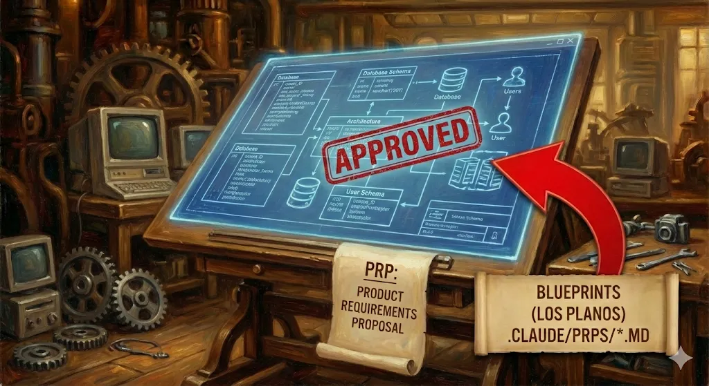

Los planos detallados de cada pieza. Antes de tocar una sola linea de codigo, se genera un **Product Requirements Proposal** (PRP). Es el "contrato" entre tu y la maquina. Si el plano esta mal, el coche sale mal. Aqui se valida la logica **antes** de construir.

---

### 3. Control Room (El Humano) — Tu, el Arquitecto

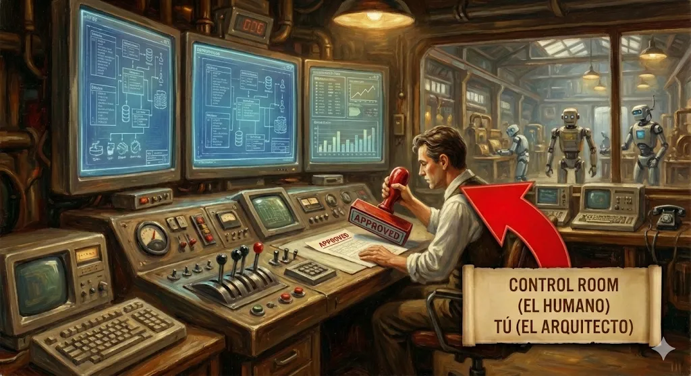

El unico componente que no es codigo. Tu trabajo no es escribir codigo, es **aprobar planos y validar calidad**. Tu decides el QUE, la fabrica ejecuta el COMO. Eres el dueno de la vision.

---

### 4. Robot Arms (Las Manos) — Terminal + Supabase MCP

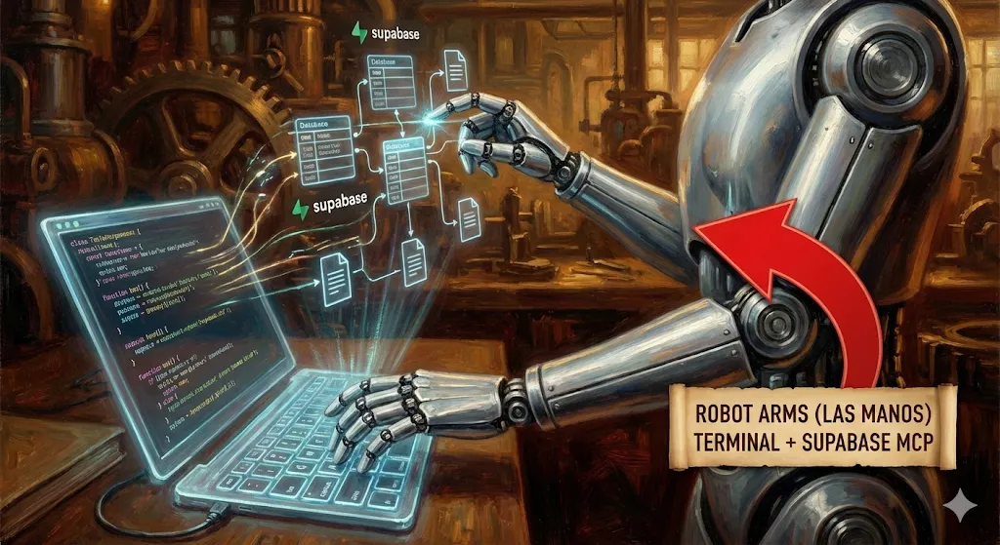

La maquinaria pesada que mueve bytes. Herramientas para crear tablas en la base de datos, ejecutar migraciones y escribir archivos. La IA no tiene que "pedirte" permiso para cada tornillo — tiene las herramientas para hacerlo bajo tu supervision.

---

### 5. Eyes/Cameras (La Vision) — Playwright MCP

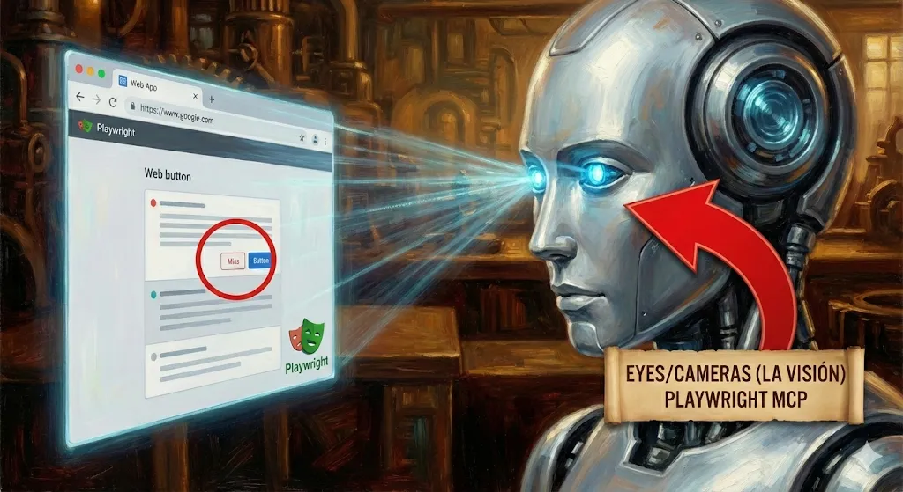

La mayoria de las IAs son **ciegas**. Con Playwright MCP, la fabrica puede abrir el navegador, ver tu app y sacar capturas. Si un boton esta chueco, los "ojos" lo ven y lo corrigen **antes de que tu lo digas**.

---

### 6. Quality Control — Next.js MCP

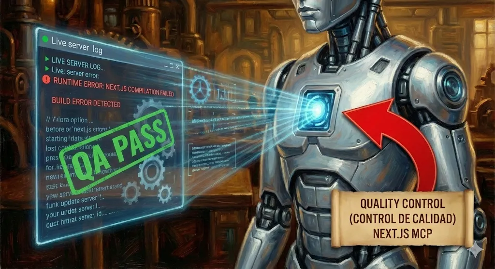

El escaner que detecta defectos de fabrica en tiempo real. Conectado directamente al servidor de desarrollo. Si algo falla en la compilacion o hay un error de runtime, se detecta al milisegundo. No "adivina" que esta roto, lo **sabe** con precision industrial.

---

### 7. Assembly Line (Linea de Ensamblaje) — Bucle Agentico

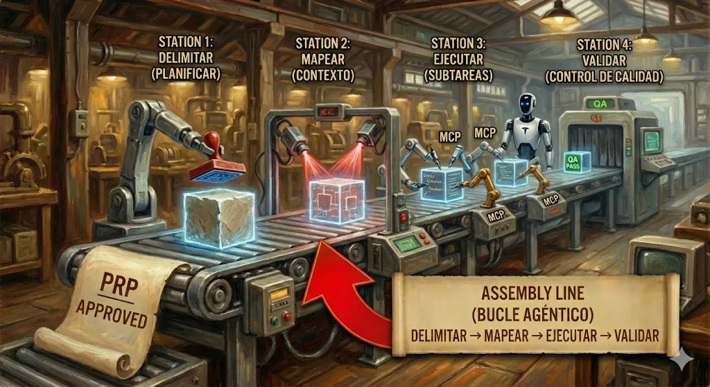

El proceso paso a paso: **Delimitar -> Mapear -> Ejecutar -> Validar**. Es lo que evita el "Vibe Coding". No se hace todo a la vez. Se va por fases, asegurando que cada pieza este perfecta antes de pasar a la siguiente estacion.

---

### 8. Neural Network (Aprendizaje) — Auto-Blindaje

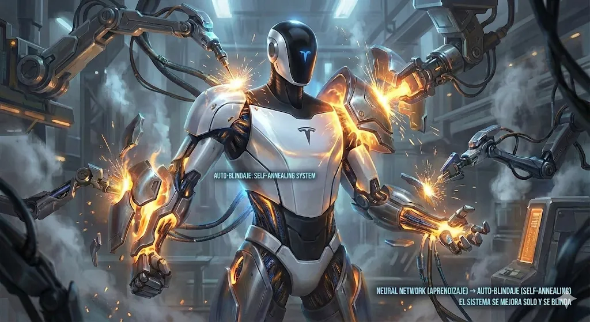

El exoesqueleto de acero. Cada vez que se comete un error, se documenta. Si un error ocurre una vez, es una leccion; si ocurre dos veces, la fabrica ha fallado. El Auto-Blindaje asegura que **la maquina sea mas fuerte manana de lo que es hoy**.

```
Error ocurre -> Se arregla -> Se DOCUMENTA -> NUNCA ocurre de nuevo
```

Cada error encontrado se documenta en el archivo relevante:
- **PRP actual** -> Errores especificos de esta feature
- **`.claude/prompts/*.md`** -> Errores que aplican a multiples features
- **`CLAUDE.md`** -> Errores criticos que aplican a TODO

---

### 9. Asset Library (Biblioteca de Activos) — Directorio `.claude/`

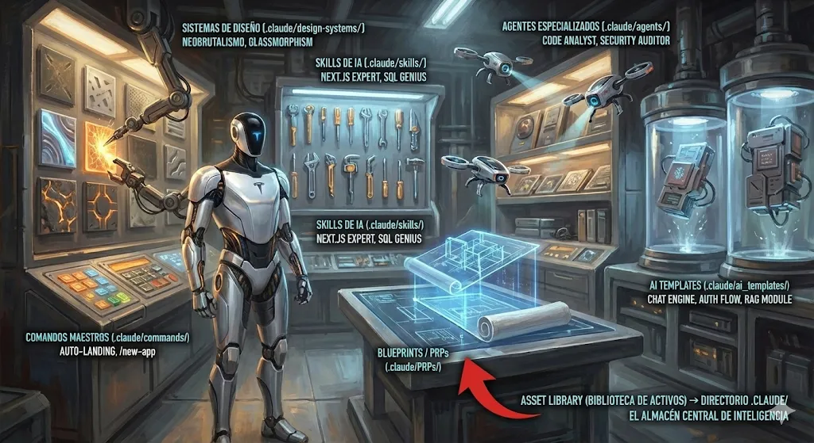

El almacen central de piezas de alto rendimiento. Aqui viven los **Comandos Maestros**, los **Sistemas de Diseno**, las **Skills**, los **Agentes Especializados** y los **Templates LEGO**. En lugar de reinventar la rueda en cada proyecto, la fabrica saca el motor de la estanteria y lo ensambla.

---

## El Golden Path (Stack Unico)

> *"Pueden tener el coche del color que quieran, siempre que sea negro."* — Henry Ford

Un solo stack perfeccionado. No hay opciones. Solo el camino dorado:

| Capa | Tecnologia | Por Que |
|------|------------|---------|
| **Frontend** | Next.js 16 + React 19 + TypeScript | Full-stack, Turbopack |
| **Estilos** | Tailwind CSS 3.4 + shadcn/ui | Utility-first, sin context switching |
| **Backend** | Supabase (Auth + DB + Storage + RLS) | PostgreSQL completo sin servidor |
| **Testing** | Playwright MCP | Validacion visual automatica |
| **Deploy** | Vercel | Un click a produccion |

---

## El Cyborg - 3 MCPs Trabajando Juntos

```typescript
// next.config.ts - Esta linea lo cambia todo
experimental: { mcpServer: true }
```

| MCP | Rol (Analogia) | Superpoder |
|-----|----------------|------------|
| **Next.js DevTools** | Quality Control | Lee errores/logs en tiempo real via `/_next/mcp` |
| **Playwright** | Eyes/Cameras | Captura screenshots, valida UX visualmente |
| **Supabase** | Robot Arms | Ejecuta SQL, migraciones, consulta logs |

**Sin MCPs:** La IA adivina que esta roto.
**Con MCPs:** La IA **ve** exactamente que esta roto y por que.

---

## Recursividad Agentica

> La capacidad de un sistema autonomo para utilizar el resultado de su propia ejecucion (exito o error) como input para su siguiente iteracion, sin intervencion humana.

<p align="center">
  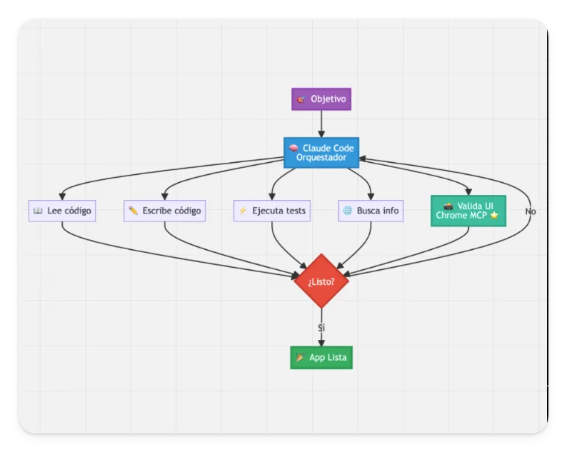
</p>

**3 principios:**

1. **Clausura del Bucle de Error** — El "No" no es un final, es una curva de retorno. Error -> El Agente lo lee -> Ajusta estrategia -> Reintenta.

2. **Iteracion Convergente** — El sistema no se detiene por tiempo, se detiene por **exito**. La unica salida posible es la "App Lista". El fracaso es solo un estado temporal.

3. **Antifragilidad** — El sistema se beneficia del caos. La version del codigo en el minuto 5 es superior a la del minuto 1 gracias a los errores cometidos en el minuto 3.

---

## Comandos Disponibles

### `/new-app` - El Arquitecto
Actua como **Consultor de Negocio Senior**. Te entrevista y genera `BUSINESS_LOGIC.md` con la especificacion tecnica completa.

### `/landing` - The Money Maker
Actua como **Copywriter + Disenador**. Crea landing pages de alta conversion validadas visualmente con Playwright.

---

## Instalacion (2 minutos)

### 1. Clona el repositorio
```bash
git clone https://github.com/saas-factory-community/saas-factory-setup.git
cd saas-factory-setup
```

### 2. Abre en Claude Code
```bash
claude .
```

### 3. Pide que configure el alias
```
Configura el alias "saas-factory" en mi terminal
```

Claude Code detecta tu sistema (zsh/bash) y configura todo automaticamente.

---

## Workflow: De 0 a Produccion

### 1. Crear proyecto
```bash
mkdir mi-saas && cd mi-saas
saas-factory
```

### 2. Instalar y configurar
```bash
npm install
cp .env.example .env.local  # Anade credenciales de Supabase
```

### 3. Prender el MCP
```bash
npm run dev
# Output: - MCP Server: http://localhost:3000/_next/mcp
```

### 4. Conectar Claude Code
```bash
claude .  # En otra terminal
```

### 5. Definir el negocio
```
/new-app
```

Responde las preguntas. El agente genera `BUSINESS_LOGIC.md`.

### 6. Construir
```
Implementa las features segun BUSINESS_LOGIC.md
```

La IA usa los MCPs para ver errores en tiempo real mientras construye.

---

## FAQ

**Por que solo Next.js?**
Hace el 100% del trabajo para el 95% de los SaaS B2B. No necesitas Python ni backends separados.

**Por que Email/Password en lugar de OAuth?**
Evita bloqueos de bots durante testing. OAuth requiere verificacion que complica el desarrollo.

**Puedo personalizar?**
Si. Todo esta disenado para ser extendido. `CLAUDE.md` es tu punto de entrada.

---

## Documentacion

| Archivo | Descripcion |
|---------|-------------|
| `CLAUDE.md` | Factory OS - Cerebro del agente |
| `GEMINI.md` | Espejo para Gemini |
| `saas-factory/CLAUDE.md` | Factory OS del template interno |
| `.claude/PRPs/` | Sistema de Blueprints |
| `.claude/prompts/` | Assembly Line (bucle agentico) |
| `.claude/commands/` | Comandos disponibles |

---

<p align="center">
  <strong>SaaS Factory</strong> — La fabrica que se fortalece con cada error.<br/>
  De la idea a produccion en minutos, no en meses.
</p>
